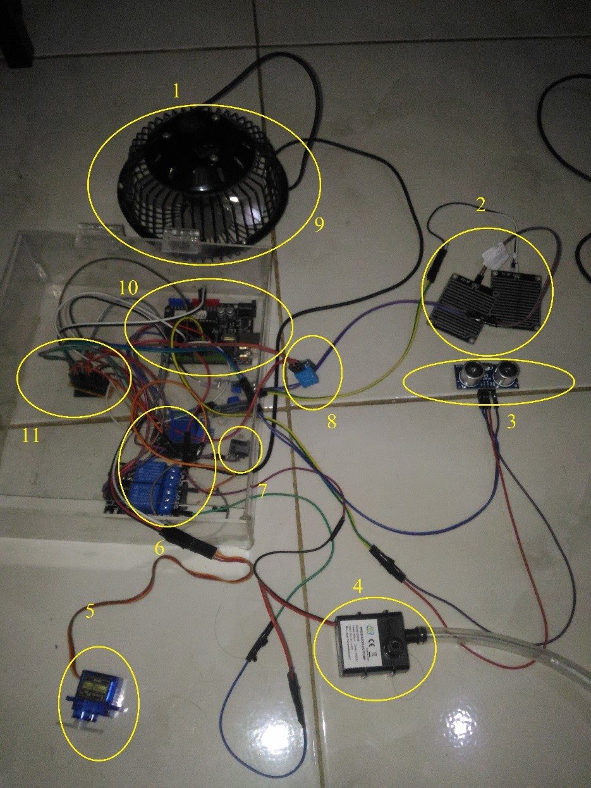
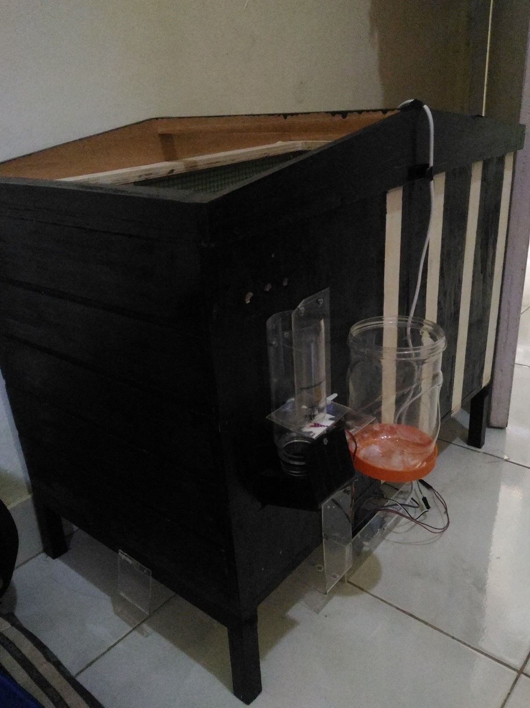
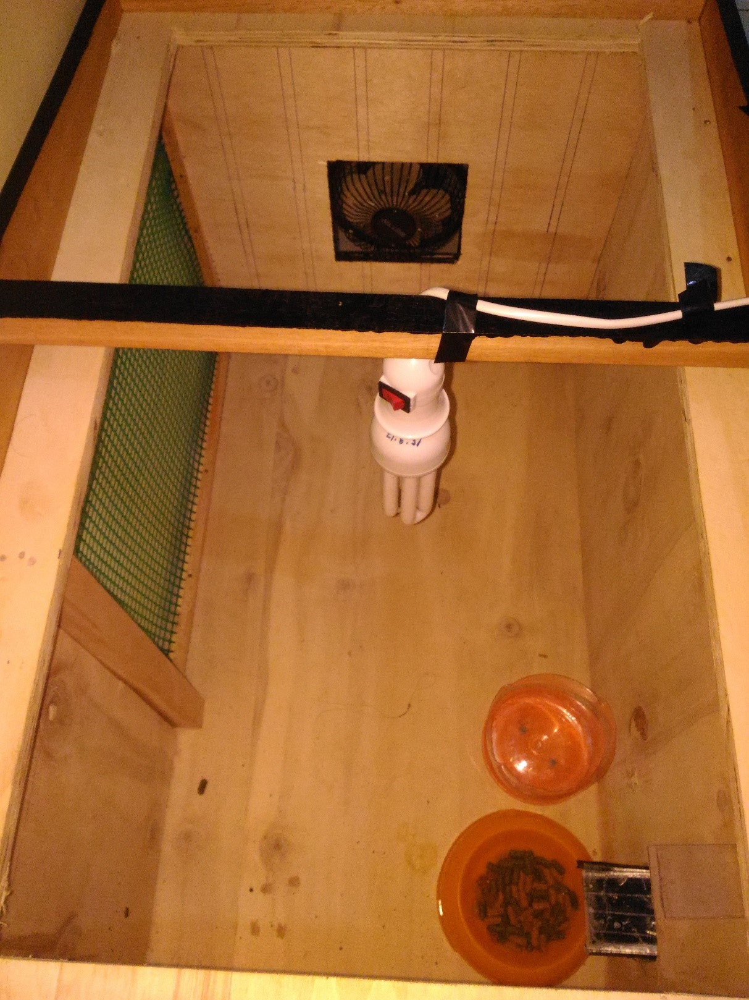

# Smart Rabbit Cage Design and Automation

This project focuses on designing and building a smart rabbit cage equipped with automation systems. It includes environmental controls such as temperature and humidity regulation, as well as automated feeding and watering systems. The project leverages sensors, actuators, and microcontrollers to ensure optimal conditions for rabbits and ease of maintenance for the owner.

## Components Used

- **DHT11 Sensor**: Measures temperature and humidity.
- **LiquidCrystal_I2C**: Displays temperature and humidity on an LCD.
- **NewPing**: Measures distance using an ultrasonic sensor.
- **Servo Motor**: Controls a mechanism based on distance measurements.
- **Relays**: Control external devices such as lights and fans.
- **Rain Sensors**: Detects the presence of rain to control a water pump.

## Block Diagram

 

## Pin Configuration

- **DHTPIN (8)**: Pin for DHT11 sensor.
- **RELAY1 (3)**: Relay control for the fan.
- **RELAY2 (5)**: Relay control for the light.
- **TRIGGER_PIN (10)**: Trigger pin for the ultrasonic sensor.
- **ECHO_PIN (9)**: Echo pin for the ultrasonic sensor.
- **powerPin (6)**: General purpose output pin.
- **sensor_hujan1 (12)**: First rain sensor.
- **sensor_hujan2 (13)**: Second rain sensor.
- **pompa (11)**: Output to control the water pump.
- **Servo**: Connected to pin 6.

## Libraries Required

- `Adafruit_Sensor`
- `DHT`
- `LiquidCrystal_I2C`
- `NewPing`
- `Servo`

## Code Functionality

### Setup

1. Initializes serial communication.
2. Configures the LCD and sensors.
3. Attaches the servo motor and sets its initial position.
4. Sets pin modes for relays, sensors, and pump.

### Loop

1. **Read Sensor Data**:

   - Reads humidity and temperature from the DHT11 sensor.
   - Reads distance from the ultrasonic sensor.
   - Reads rain sensor values.

2. **Display Data**:

   - Displays humidity and temperature on the LCD.
   - Prints the sensor data to the Serial Monitor.

3. **Control Devices**:
   - **Fan and Light**: Controls based on temperature readings.
   - **Water Pump**: Activated or deactivated based on rain sensor readings.
   - **Servo Motor**: Adjusts position based on distance measurements.

## Installation and Usage

1. Connect all components according to the pin configuration.
2. Upload the Arduino sketch to your board.
3. Open the Serial Monitor to view live data.
4. Observe the LCD and relay-controlled devices for real-time feedback.

## Mockup Overview

  

  

  

## Troubleshooting

- Ensure all components are correctly connected and powered.
- Verify the pin configurations match your setup.
- Adjust delays and sensor thresholds as needed.

## License

This project is licensed under the MIT License. See the `LICENSE` file for more details.

For further customization and improvements, feel free to modify the code and settings to better suit your needs.
